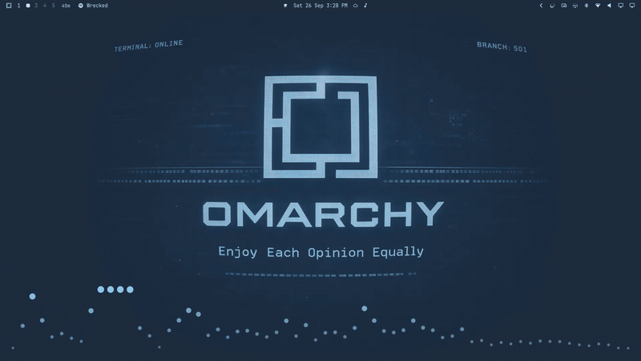
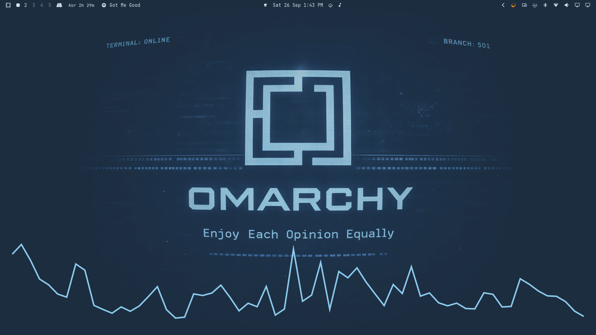

# Spotify Wave

A 10-band equalizer **and** a desktop audio spectrum visualizer for Spotify,
for Omarchy 4 (Quattro / Quickshell), controlled from the bar.

- A `service` (`Service.qml`) renders the spectrum along the bottom of the
  desktop, one click-through layer surface per screen.
- A `bar-widget` (`Panel.qml`) exposes both halves: preamp, ten band sliders,
  presets, bypass/reset for the EQ; on/off, source, style, screen, sensitivity,
  band count, height, margin and dot size for the visualizer.

The EQ is a PipeWire filter-chain sink (`spotify_wave`) that the Spotify stream
is routed into; the visualizer draws from that same sink's monitor. One sink,
one graph, both features.

Audio analysis is done by [`cava`](https://github.com/karlstav/cava), which
prints one ASCII frame per line on stdout. The service starts `cava` against
the config bundled at `config/cava` and parses those frames — nothing decodes
audio inside the shell.

> **One-time setup required.** Two manual steps: install `cava`, then run
> `bin/spotify-wave-setup install` once. See [Install](#install).

## Demo



<sub>Static preview:</sub>



## How it works

`bin/spotify-wave-setup install` installs four fragments and enables the
filter-chain host:

- `config/pipewire/filter-chain.conf.d/60-spotify-wave.conf` — the graph: a
  linear preamp followed by ten `bq_peaking` biquads at 31, 62, 125, 250, 500,
  1k, 2k, 4k, 8k, 16k Hz (Q = 1.0). It publishes the `spotify_wave` sink
  (`node.description = "Spotify Wave"`) and the `spotify_wave_output` playback
  node that follows the current default sink.
- `config/pipewire/client.conf.d/60-spotify-wave.conf` — a `stream.rules` match
  applied by the client itself. This is what routes the **official Spotify
  desktop client**, which connects to PipeWire directly (native protocol) and
  therefore never passes through pipewire-pulse's `pulse.rules`.
- `config/pipewire/pipewire-pulse.conf.d/60-spotify-wave.conf` — a
  `pulse.rules` match that routes PulseAudio-protocol Spotify streams (the
  librespot / spotifyd backends) into `spotify_wave`.
- `config/wireplumber/wireplumber.conf.d/60-spotify-wave.conf` — the companion
  that sets `state.restore-target = false` so WirePlumber does not restore a
  previous target over the assigned one.

Both routing fragments set the same `target.object = "spotify_wave"` and use
the same matches, so exactly one of them fires for any given Spotify client
depending on whether it speaks the native or PulseAudio protocol.

`spotify_wave` is a virtual sink: do **not** set it as the default output.
Only the Spotify stream is moved into it. To listen to Spotify without the EQ,
use the bypass toggle (or set `preamp` down) rather than changing the default.

## Requirements

- Omarchy 4 (Quattro) with the Quickshell shell (`omarchy-shell`).
- PipeWire + WirePlumber with `filter-chain.service` (shipped by PipeWire; the
  setup script enables it). `cava` is the one additional package, listed next.
- Spotify playback through the `quickshell.spotify` plugin (librespot /
  `spotifyd`) or the official Spotify desktop client. With `source` set to
  `All output` the spectrum reacts to any system audio instead.
- [`cava`](https://github.com/karlstav/cava) — required; it does all audio
  analysis. Install it with `omarchy pkg add cava` or `sudo pacman -S cava`.

## Install

1. Install `cava`, the audio analyser:

   ```
   omarchy pkg add cava
   ```

2. Add and enable the plugin:

   ```
   omarchy plugin add https://github.com/naimhasim/omarchy-spotify-wave.git --enable
   ```

3. Install the engine fragments:

   ```
   ~/.config/omarchy/plugins/naimhasim.spotify-wave/bin/spotify-wave-setup install
   ```

The shell never runs plugin code, so step 3 — the one-time engine install — is
required. It is safe to re-run after editing anything under `config/`.

## Remove

```
~/.config/omarchy/plugins/naimhasim.spotify-wave/bin/spotify-wave-setup uninstall --purge
omarchy plugin disable naimhasim.spotify-wave
omarchy plugin remove naimhasim.spotify-wave
```

`uninstall` removes the installed fragments and restores `filter-chain.service`
to the enabled state it had before install; it is only disabled again when the
install was what enabled it, so a unit shared with other filter-chains is left
untouched. `--purge` also deletes the state directory (settings and the
install's enablement record). Drop `--purge` to keep the saved settings across a
reinstall. `cava` is a system package and is left installed; remove it with
`omarchy pkg drop cava` if unwanted.

## Layout

```
manifest.json    plugin manifest (service + bar-widget entry points)
Service.qml      service: cava process + desktop layer surfaces
Panel.qml        bar button + popup panel (EQ + visualizer)
bin/spotify-wave         helper CLI (owns state; writes config/cava)
bin/spotify-wave-setup   installs/removes the PipeWire/WirePlumber fragments
config/cava              cava configuration consumed by Service.qml
config/pipewire/filter-chain.conf.d/60-spotify-wave.conf
config/pipewire/client.conf.d/60-spotify-wave.conf
config/pipewire/pipewire-pulse.conf.d/60-spotify-wave.conf
config/wireplumber/wireplumber.conf.d/60-spotify-wave.conf
```

`bin/` and `config/` are helper-owned. The QML halves only read the state file
and launch `cava`; they never write state.

## Settings

All settings live in one state file:

```
${XDG_STATE_HOME:-$HOME/.local/state}/spotify-wave/state.json
```

On first run the helper seeds it from the old
`~/.local/state/spotify-eq/state.json` and
`~/.local/state/spotify-visualizer/settings.json` if those exist (without
deleting them); otherwise it writes the defaults below.

### Equalizer

| Key | Type | Default | Notes |
|---|---|---|---|
| `eqEnabled` | bool | `true` | bypass: when false the sink is driven flat |
| `preamp` | number | `0` | dB, clamped to -12..+12 (`preamp:Mult` internally) |
| `preset` | string | `"Flat"` | `Flat`, `Bass Boost`, `Treble Boost`, `Vocal`, `Loudness`, `Rock`, or `Custom` |
| `bands` | number[10] | all `0` | dB per band, each clamped to -12..+12 |

### Visualizer

| Key | Type | Default | Notes |
|---|---|---|---|
| `vizEnabled` | bool | `true` | run cava and show the strip |
| `style` | string | `"Dots"` | `Dots`, `Particles`, `Bars`, `Mirrored`, `Wave`, `Peaks`, `Aurora` |
| `screen` | string | `"all"` | `all` or a screen name |
| `source` | string | `"Spotify"` | `"Spotify"` (`spotify_wave.monitor`) or `"All output"` (default output monitor) |
| `sensitivity` | number | `1.0` | 0.25–3.0 |
| `bars` | int | `64` | 16–64; cava restarts when changed |
| `height` | int | `320` | strip height (px), 40–400 |
| `margin` | int | `24` | gap from the screen edges (px), 0–200 |
| `dotSize` | int | `6` | base dot diameter (px), 2–24 |

`Service.qml` watches the file with `FileView { watchChanges: true }` and reacts
immediately; `Panel.qml` watches the same file and also calls `status` when
opened. Missing file → built-in defaults, retried every 2 s until the helper
creates it.

`source` selects what the spectrum reacts to:

- **Spotify** (default) — `spotify_wave.monitor`, so only Spotify audio is
  visualised and the EQ is in the path.
- **All output** — cava's `auto` source, i.e. the currently selected output's
  monitor, so the spectrum follows all system audio.

`set source` and `ensure-source` resolve the setting against the live sinks and
rewrite the `source` line in `config/cava`; the helper is the only writer.
`status` reports the resolved value as `effectiveSource`. `Service.qml` also
watches the `source` line itself and restarts cava when the resolved monitor
changes.

## Styles

- **Dots** — one circle per band, rising and growing with level.
- **Particles** — the dot plus a short rising, fading trail.
- **Bars** — bottom-anchored columns.
- **Mirrored** — columns growing both ways from the vertical centre.
- **Wave** — a single `Canvas` polyline through the band levels.
- **Peaks** — bottom-anchored columns with a falling cap tracking each band's maximum.
- **Aurora** — wide gradient ribbons whose height/opacity follow bass, mid and
  high averages and drift on a slow animated phase.

All use `Color.accent` / `Color.foreground`, so they follow the active theme.

## Helper contract

`Panel.qml`/`Service.qml` resolve the helper at `bin/spotify-wave` relative to
themselves and shell-quote every argument with `Util.shellQuote`.

| Command | Purpose |
|---|---|
| `status` | print the state JSON, plus `effectiveSource` (the resolved cava source) |
| `find-node` | exit 0 when the `spotify_wave` node exists |
| `set <i> <gain> [...]` | set EQ band gain(s) by 0-based index (numeric args) |
| `preamp <dB>` | set preamp |
| `preset <name>` | apply a named preset |
| `reset` | flat EQ: bands 0, preamp 0 dB |
| `eq-enable` / `eq-disable` | apply / bypass the EQ |
| `apply` | push the current EQ state to the sink |
| `set <key> <value>` | persist one visualizer setting (word key; rewrites `config/cava` for `bars`/`source`) |
| `toggle` | flip `vizEnabled` |
| `ensure-source` | resolve `source` against the live sink and rewrite `config/cava` if needed; prints `changed`/`same` |
| `verify-source` | check running cava's capture monitor; exit 0 match, 1 mismatch, 2 unknown |

`set` dispatches on its first argument: all-numeric means EQ bands, a word means
a visualizer setting. Numeric drags update the UI immediately but are coalesced
by a 70 ms `Timer`, so a drag results in one helper call, not one per pixel.
Concurrent helper invocations serialize their state writes with `flock`.

## Notes

- The strip surface uses `WlrLayer.Bottom`, `WlrKeyboardFocus.None`,
  `ExclusionMode.Ignore` and `mask: Region {}`, so it is fully click-through
  and never blocks desktop input.
- When `vizEnabled` is false — or `cava`/`config/cava` are absent — the strip
  is hidden and the process is stopped. The availability probe retries every
  10 s while enabled, never in a busy loop.
- The EQ is kept live with `node.always-process = true`, so controls set while
  Spotify is idle survive the next stream.
- `cava` is restarted only when `bars` or the resolved `source` changes; the
  other settings are live.

## License

MIT. See [LICENSE](LICENSE).

## Security

This plugin runs unsandboxed inside the long-lived `omarchy-shell` process,
with the same file and process access as your user. The Omarchy marketplace
lists plugins but does not security-review them. Read the source before
enabling.
